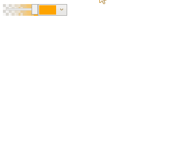

#  FancyPrimitives

FancyPrimitives is a WPF library containing some commonly used controls.

It is an open source library and is completely free for commercial use.


<br/>FancyPrimitives contains the folowing controls:

## CircleWaitIndicator

Allows to notify the user that he needs to wait.<br/>
The **CircleWaitIndicator** class is derived from the [UserControl](https://docs.microsoft.com/en-us/dotnet/api/system.windows.controls.usercontrol?view=netframework-4.7.2) class.


Set the **IsRunning** property to start or stop the animation.

XAML Example:
```xml
    <fp:CircleWaitIndicator xmlns:fp="clr-namespace:FancyPrimitives;assembly=FancyPrimitives"
                            Width="35" Height="35" 
                            Fill="RoyalBlue" 
                            IsRunning="True"/>
```

## StandardColorPicker

Allows to select a color from the standard set of Predefined .NET [Colors](https://docs.microsoft.com/en-us/dotnet/api/system.windows.media.colors?view=netframework-4.7.2).<br/>
The **StandardColorPicker** class is derived from the [UserControl](https://docs.microsoft.com/en-us/dotnet/api/system.windows.controls.usercontrol?view=netframework-4.7.2) class.


Use the **SelectedColor** property to set or get the selected color. For cases where you set the **SelectedColor** property to a value that is not in the [Colors](https://docs.microsoft.com/en-us/dotnet/api/system.windows.media.colors?view=netframework-4.7.2) list, **StandardColorPicker** have one last cell to store a custom color. This last cell will automatically be set to your custom color. 

XAML Example:
```xml
    <fp:StandardColorPicker xmlns:fp="clr-namespace:FancyPrimitives;assembly=FancyPrimitives"
                            SelectedColor="Red"/>
```

## StandardColorPickerWithAChannel

The same as the **StandardColorPicker** control, but additionally allows to specify the transparency of selected color.<br/>
The **StandardColorPickerWithAChannel** class is derived from the [UserControl](https://docs.microsoft.com/en-us/dotnet/api/system.windows.controls.usercontrol?view=netframework-4.7.2) class.



XAML Example:
```xml
    <fp:StandardColorPickerWithAChannel xmlns:fp="clr-namespace:FancyPrimitives;assembly=FancyPrimitives"
                                        SelectedColor="Orange"/>
```

## PenSelector

Allows to select a [Pen](https://docs.microsoft.com/en-us/dotnet/api/system.windows.media.pen?view=netframework-4.7.2) with a specified color from the [Colors](https://docs.microsoft.com/en-us/dotnet/api/system.windows.media.colors?view=netframework-4.7.2) list, transparency of the color, and [Thickness](https://docs.microsoft.com/en-us/dotnet/api/system.windows.media.pen.thickness?view=netframework-4.7.2#System_Windows_Media_Pen_Thickness) of the pen.<br/>
The **PenSelector** class is derived from the [UserControl](https://docs.microsoft.com/en-us/dotnet/api/system.windows.controls.usercontrol?view=netframework-4.7.2) class.


Use the **SelectedPen** property to set or get the selected [Pen](https://docs.microsoft.com/en-us/dotnet/api/system.windows.media.pen?view=netframework-4.7.2) value.

XAML Example:
```xml
    <fp:PenSelector xmlns:fp="clr-namespace:FancyPrimitives;assembly=FancyPrimitives">
        <fp:PenSelector.SelectedPen>
            <Pen>
                <Pen.Brush>Crimson</Pen.Brush>
                <Pen.Thickness>1</Pen.Thickness>
            </Pen>
        </fp:PenSelector.SelectedPen>
    </fp:PenSelector>
```

## UpDownButtonBlock

Contains a pair of arrow buttons that the user can click to increment or decrement the value of some integer property of some another control, such as an integer TextBox.<br/>
The **UpDownButtonBlock** class is derived from the [Control](https://docs.microsoft.com/en-us/dotnet/api/system.windows.controls.control?view=netframework-4.7.2) class.


You have to bind the **UpButtonPressedCommand** and **DownButtonPressedCommand** properties of this control to [Commands](https://docs.microsoft.com/en-us/dotnet/api/system.windows.input.icommand?view=netframework-4.7.2) that implement incrementation and decrementation of something. Therefore, if you need to increment and decrement some property of some control, it's reasonable to make this this control expose such a [Commands](https://docs.microsoft.com/en-us/dotnet/api/system.windows.input.icommand?view=netframework-4.7.2) as properties. The **FancyPrimitives** library contains the **IntegerTextBox** control (derived from [TextBox](https://docs.microsoft.com/en-us/dotnet/api/system.windows.controls.textbox?view=netframework-4.7.2)) that has the **IncrementValueCommand** and **DecrementValueCommand** properties, and can be used in conjunction with the **UpDownButtonBlock** control (see example below). 

XAML Example:
```xml
    <StackPanel Orientation="Horizontal">
        <fp:IntegerTextBox xmlns:fp="clr-namespace:FancyPrimitives;assembly=FancyPrimitives"
                           x:Name="intTextBox" 
                           Text="0" 
                           Width="30"/>

        <fp:UpDownButtonBlock xmlns:fp="clr-namespace:FancyPrimitives;assembly=FancyPrimitives"
                              Width="20" Height="{Binding ElementName=intTextBox, Path=ActualHeight}" 
                              UpButtonPressedCommand="{Binding ElementName=intTextBox, Path=IncrementValueCommand}"
                              DownButtonPressedCommand="{Binding ElementName=intTextBox, Path=DecrementValueCommand}"/>
    </StackPanel>
```
## IntegerTextBox

A [TextBox](https://docs.microsoft.com/en-us/dotnet/api/system.windows.controls.textbox?view=netframework-4.7.2) derived control intended for storing integer values. This control is useful mostly in pair with the **UpDownButtonBlock** control. The [Commands](https://docs.microsoft.com/en-us/dotnet/api/system.windows.input.icommand?view=netframework-4.7.2) returned by the **IncrementValueCommand** and **DecrementValueCommand** properties increment and decrement the [Text](https://docs.microsoft.com/en-us/dotnet/api/system.windows.controls.textbox.text?view=netframework-4.7.2#System_Windows_Controls_TextBox_Text) property value respectively. Set the **MinValue** and **MaxValue** properties to bound the [Text](https://docs.microsoft.com/en-us/dotnet/api/system.windows.controls.textbox.text?view=netframework-4.7.2#System_Windows_Controls_TextBox_Text) property value.<br/>

XAML Example:
```xml
    <fp:IntegerTextBox xmlns:fp="clr-namespace:FancyPrimitives;assembly=FancyPrimitives"
                       MinValue="0" MaxValue="100"
                       Text="0"/>
```

# Got questions?
If you have any questions or suggestions, don't hesitate to submit a new GitHub issue.

# License
[MIT license](https://github.com/gellerda/FancyPrimitives/blob/master/LICENSE).
